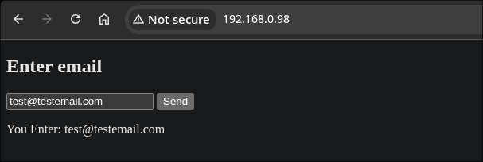
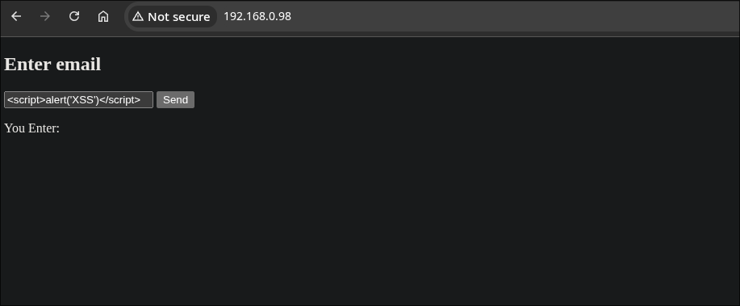
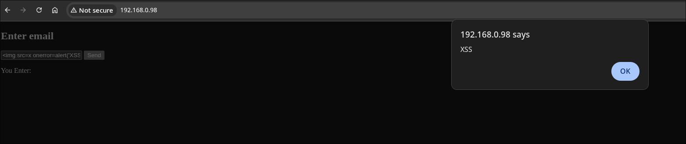
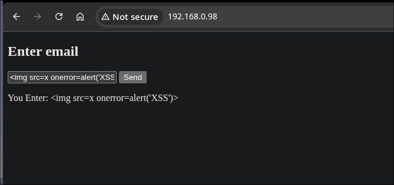
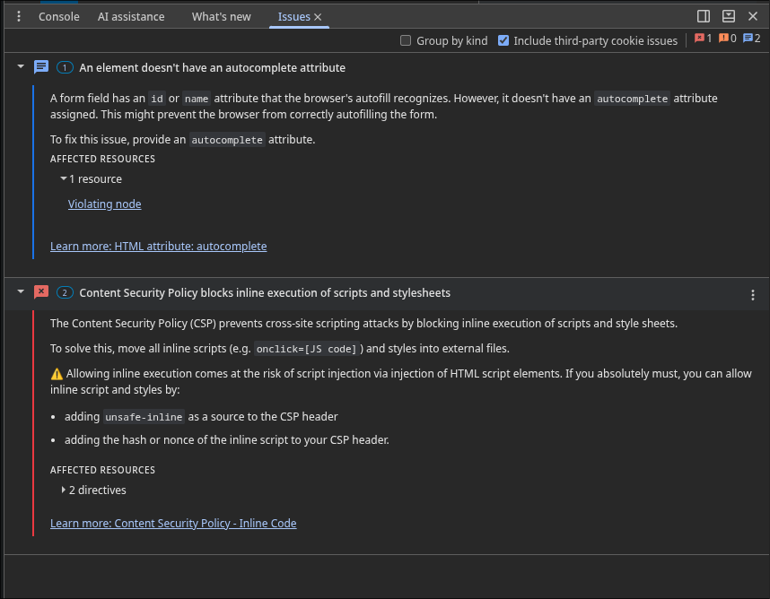

# DOM-based Cross-Site Scripting (DOM XSS)

# TL;DR
Cross-Site Scripting is a vulnerability that appears because untrusted data reaches a dangerous function (sink) without being neutralized. It can lead to stealing session data, performing actions on behalf of another user, or modifying the page.

# Vulnerability
DOM-based XSS (Document Object Model Cross-Site Scripting) is a web application vulnerability where a malicious script is executed in the user's browser due to insecure client-side processing of data in JavaScript.

The vulnerability follows the source → sink model: it happens when data reaches a sink from a source without sanitization.

In code:
```javascript
element.innerHTML = 'You enter: ' + email;
```

The user's string is concatenated and passed into `innerHTML`. Since there is no sanitization, the source reaches the sink directly.

Because `innerHTML` does not just insert text but parses the string as HTML, everything that gets there is treated by the browser as markup.

So if you type `` into the input field, the browser will not show it as text — it will create an element with an `onerror` handler. From this we can conclude that `innerHTML` is dangerous.

# Environment
- OS: Ubuntu Server 26.04 LTS
- Web Server: nginx
- App: static HTML page with an email input form
- The entered value is printed back to the page through `innerHTML`
- Start: `sudo systemctl start nginx`
- Access: `http://serverIP/`

# PoC
Here is the page with the email input. First I entered an email to check that the page works:



The test showed that the page works and printed back my entered email "test@testemal.com".

As a next step I tried to enter malicious code into the input field — `<script>alert('XSS')</script>`:



As you can see on the screenshot, this action produced nothing. The thing is that a `<script>` tag inserted through the `innerHTML` property is not executed by the browser. This comes from HTML5 behavior: scripts added to the DOM this way are marked with the "already started" flag, so the browser does not run them.

Important note: this is still NOT a sign that the site is protected. The vulnerability is there, it is just triggered differently.

Next I tried to use a tag that produces an event on its own, with an inline handler attached to it:

```

```

Demonstration:



We can see that the vulnerability is confirmed. The handler executed — this is XSS.

# Impact
Formally, the vulnerability affects confidentiality and integrity — two parts of the CIA triad.

Executing your own JS code in the context of the page gives the attacker:
- Session theft: access to `document.cookie` (if the cookie has no HttpOnly flag) and to tokens in localStorage/sessionStorage, which allows stealing the account
- Actions on behalf of the victim: the script can send requests as the user (for example, change the account password or send a message)
- Phishing: the script can replace the page content. For example, inserting a fake login form.
- Keylogging: intercepting the victim's input on the page

# Remediation
First, I want to split the solution into two levels:
- Level 1 — the root fix
- Level 2 — defense in depth

Level 1:
If `innerHTML` is not critically needed, you should drop it and replace it with `textContent`:
```
element.textContent = 'You enter: ' + email;
```
This fixes the problem at its root, and the malicious code is displayed literally as characters:



If HTML output is really necessary, you need to escape special characters, or use a proven library, for example DOMPurify.

Level 2:
The Content-Security-Policy (CSP) header.

This header tells the browser which code is allowed to run. Example:
```
add_header Content-Security-Policy "default-src 'self';";
```

Important note: you cannot replace Level 1 with Level 2, because CSP does not fix the bug itself — the data still reaches `innerHTML`. CSP just does not let the malicious code execute. So Level 2 is an addition, but in no way a replacement for the first level.

# Verification

Now let's run a training attack with the protection already in place:


As we can see, the malicious code was displayed as characters.

Now let's deliberately bring back `innerHTML` to check how CSP works, and try to send the malicious code:



As we can see in DevTools, our CSP refused to execute the malicious code. After confirming that CSP works, I bring back `textContent` and keep CSP connected — now both levels are active at the same time. The protection is built successfully!

# References
* [OWASP: Cross Site Scripting (XSS)](https://owasp.org/www-community/attacks/xss/)
* [OWASP: DOM based XSS Prevention Cheat Sheet](https://cheatsheetseries.owasp.org/cheatsheets/DOM_based_XSS_Prevention_Cheat_Sheet.html)
* [OWASP: XSS Filter Evasion Cheat Sheet (payload list)](https://cheatsheetseries.owasp.org/cheatsheets/XSS_Filter_Evasion_Cheat_Sheet.html)
* [MDN Web Docs: Element.innerHTML (Security considerations section)](https://developer.mozilla.org/en-US/docs/Web/API/Element/innerHTML)
* [MDN Web Docs: Node.textContent](https://developer.mozilla.org/en-US/docs/Web/API/Node/textContent)
* [MDN Web Docs: Content-Security-Policy](https://developer.mozilla.org/en-US/docs/Web/HTTP/Guides/CSP)
* [PortSwigger Web Security Academy: DOM-based XSS](https://portswigger.net/web-security/cross-site-scripting/dom-based)
* [CWE-79 (mitre.org)](https://cwe.mitre.org/data/definitions/79.html)
